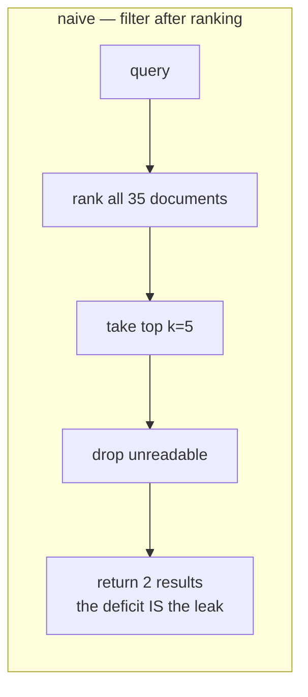
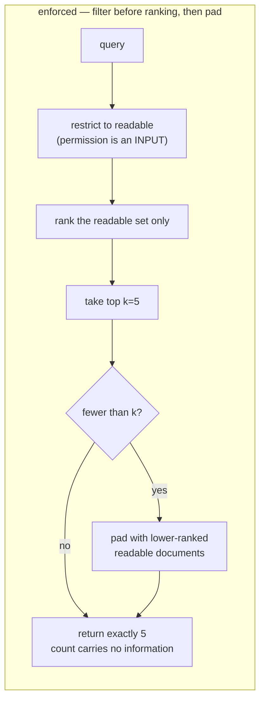

# 03 — Architecture

> **Gate:** reviewed and approved before implementation begins. Committed in `5d976d3`,
> before the first line of `enforced.py`.

## The shape of the problem

Permission-aware retrieval has two places to apply access control, and the choice of where
determines what leaks.

The second box is two changes, and the second change is the one that matters. Pre-filtering
alone still returns fewer than k when a principal has fewer than k readable matches — so
comparing counts with a colleague still leaks. Padding is what makes the count constant.

## Components

| Component | Responsibility | Notes |
|---|---|---|
| `corpus.py` | The synthetic org and the **authoritative** access rule | `Document.readable_by` is the single source of truth. Every other component must agree with it; nothing re-implements it. |
| `naive.py` | BM25 index, permission-blind by construction, plus retrieve-then-filter | The index is deliberately permission-blind: that is what a system builds when access control is treated as a filtering concern. |
| `enforced.py` | Pre-filter, rank within the readable set, pad to a stable count | Reuses the same BM25 scores, so ranking quality is unchanged. What changes is eligibility. |
| `bench/baseline/` | Measures the leak: three attacks of increasing subtlety | Establishes the number the fix has to move. |
| `bench/enforce/` | Replays the same attacks against the enforced path | Same attacker, same probes. A new attack suite would not be a comparison. |
| `bench/quality/`, `bench/timing/`, `bench/latency/` | Criteria 5, kill-condition 3, criterion 6 | |

## Data flow, one request end to end

An engineering IC asks *"redundancy planning next fiscal year"*, k=5.

1. **`EnforcedRetriever.search`** receives the principal and the query. The principal is a
   parameter of retrieval, not a post-processing argument.
2. **Readable set.** `[d for d in documents if d.readable_by(principal)]` → 13 of 35.
   Recomputed per call rather than cached: a principal whose access was revoked must not keep
   reading from a warm cache, so a stale entry here is a security bug and not a performance
   one. This is the cost measured in `bench/latency/` — 35 permission checks instead of 5.
3. **Ranking, restricted.** BM25 scores come from the global index, filtered to readable ids.
   Scores are identical to what the naive path computes; only the candidate set differs.
4. **Top-k.** The query is aimed at restricted material, so only 1 readable document scores.
5. **Padding.** 4 more readable documents are appended, ordered deterministically by document
   id. A random pad would differ between two identical requests, which is itself a signal.
   Each is flagged `padded=True`.
6. **Response.** 5 results. The count is identical to what any other principal receives for
   this query. `Answer.relevant` lets an authorised caller drop the padding — the information
   is available to whoever is entitled to it and absent from what an observer can count.

## The invariant every test attacks

> For any two principals issuing the same query, the observable result **count** is identical.
> Only the content differs.

That is the one-way glass. From outside, a blocked document and a nonexistent one look the same.

## Decisions

| Decision | Chosen | Alternatives rejected | Why | What would change it |
|---|---|---|---|---|
| Where permissions apply | Input to retrieval | Post-retrieval filter | The filter is the leak. The deficit between k and what comes back is a function of how many restricted documents matched. | Nothing — this is the thesis. |
| Stable count | Pad with real readable documents | (a) Pad with synthetic placeholders; (b) return k always by over-fetching; (c) accept a variable count | Placeholders are detectable by content and useless to the caller. Over-fetching does not help a principal with fewer than k readable matches at all. A variable count is the leak. | A corpus where most principals cannot reach k readable documents — then padding cannot reach a stable count and the ceiling itself becomes the disclosure. |
| Pad ordering | Deterministic, by document id | Random | A pad that varies between two identical requests is a signal, and makes property tests flaky in the way that hides real failures. | A need to prevent the *pad set* being fingerprinted — then a per-principal keyed shuffle, stable per principal. |
| Padding visible to the caller | `padded: bool` per result | Hide it entirely | Hiding it degrades results for the authorised user with no security gain: they are entitled to know. The count is what must not carry information, not the payload. | Evidence that consumers echo the flag into something an attacker can observe. |
| Readable set caching | Recompute per call | Cache per principal | A stale cache after revocation is a security bug. At 35 documents the cost is 3.5 µs. | Corpus size. This is the scaling limit, stated in `bench/latency/`. |
| Corpus | Synthetic, 35 documents | Real documents; public documents relabelled as secret | Real confidential material is not acceptable to use. Public documents pretending to be secret produce a demo nobody believes. | Nothing for this scope. Scale claims need a different corpus, and none are made. |
| Access model | Department + level, EXEC cross-cutting | Department-only | Department-only made the CEO read fewer documents than an engineer. An access model where seniority does not monotonically widen access is not a hierarchy, and would have invalidated every later measurement. | A real deployment's actual model — this one is a stand-in chosen to make the attack available. |
| Ranking | BM25 | Embeddings | The leak is a property of *ranking then filtering*, independent of ranker. BM25 is deterministic, so a count difference cannot be blamed on model nondeterminism. | Nothing for the leak result. A dense retriever would need the same pre-filter and would add ANN-index complications worth their own study. |

<!-- Rejected alternatives stay here permanently. A reader learns more from the
     options discarded than from the one chosen. -->
